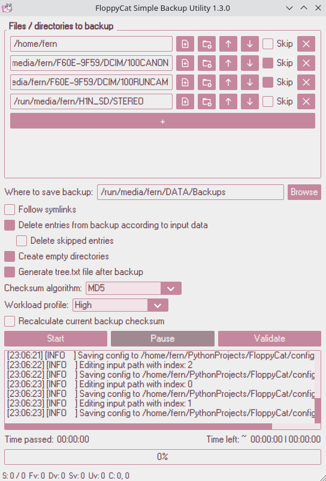

# 💾🐈‍⬛ FloppyCat Simple Backup Utility

|  |  |
| --------------------------------- | :-------------------------------------: |

## Simple high-performance utility for creating and validating checksums-based backups with full multiprocessing support

----------

## 😋 Support project

Support the project by buying and listening to my music 🎵

- 🟦 [Bandcamp](https://f3rni.bandcamp.com)
- 🟧 [SoundCloud](https://soundcloud.com/f3rni)

Or message me if you would like to donate 💰

----------

## 🚀 Performance

### Test #1. First backup

Test conditions:

- Backup entire `/home/$USER` directory excluding `.wine` (`~171.1 GiB`) + external `~10.6 GiB` MicroSD card (audio files) to the empty external SSD drive
- `~181.7 GiB` total
- Checksum algorithm: `MD5`
- Workload profile: `High`
  - 9 / 12 processes on Intel i7-9750H
- Create empty directories

Result:

- Total backup time: **~40 minutes**
- Files viewed: **975494**, directories viewed: **161026**
- Checksums calculated: **975489**, errors: **0**
- Files and directories copied: **975385**, errors: **5**
- Files and directories deleted: **0**, errors: **0**
- Directories created: **127612**, errors: **0**

----------

## ❓ Get started

1. Download executable from releases or build it yourself (see  **🏗️ Build from source** section)
2. Add directories or files you want to backup by pressing `+` button in _Files / directories to backup_ section
3. Select path using `📄+` or `📁+` buttons or type it manually inside _File / directory path to backup_ field
   1. The priority of files / directories is **from top to bottom**. Use `⬆️` / `⬇️` buttons to move input files / directories
   2. If you want to exclude a file / directory from the backup, check `Skip`
   3. The `🗑️` button will remove the current path from the input data (it will not be copied to the backup)
4. Select output (backup) directory by pressing `Browse` button or type path manually near _Where to save backup:_
5. Change settings if you need:
   1. `Follow symlinks` - If set, during tree generation (before calculating checksums, deleting and copying files), symbolic links will be followed (if supported by the system) **_Default:_** `Unchecked`
   2. `Delete entries from backup according to input data` - If set, those files inside the existing backup that don't exist in the input paths will be deleted. **Without this flag, files from the backup will never be deleted.** **_Default:_** `Checked`
      1. `Delete skipped entries` - If set, files in skipped paths will also be deleted from the existing backup. Without this flag, if files exist even in the skipped paths, they will not be deleted. **_Default:_** `Unchecked`
   3. `Create empty directories` - If set, all empty folders in the input paths will also be created in the backup. **Without this flag, only non-empty directories will be copied.** **_Default:_** `Checked`
   4. `Generate tree.txt file after backup` - If set, upon completion of the backup, a `tree.txt` file will be created with the following content:

      ```text
      doc/
      ├── _static/
      │   ├── embedded/
      │   │   ├── deep_file
      │   │   └── very/
      │   │       └── deep/
      │   │           └── folder/
      │   │               └── very_deep_file
      │   └── less_deep_file
      ├── checksums.md5
      ├── some_file
      └── tree.txt
      ```

      **_Default:_** `Checked`
   5. `Checksum algorithm:` - Select an algorithm for checksum calculating. **_Default:_** `MD5`
   6. `Workload profile:` - Select the impact of the backup on the system. The higher the value, the more CPU cores will be used. **_Default:_** `Normal`
   7. `Recalculate current backup checksum` - If set, the checksum of the existing backup will be recalculated each time. **Without this value, the existing checksum file will be used for comparing existing data with input data and for final `checksums.*` file** **_Default:_** `Unchecked`
6. Press `Start` button to start the backup process. Upon completion of the backup, **you will get a copy of your data and a file with their checksums** _(as well as some useful statistics and a `tree.txt` file, if `Generate tree.txt file after backup` option was enabled)_
7. If after some time, you need to check whether the data in the backup has become corrupted, specify your backup directory using _Where to save backup:_ and press `Validate` button. The checksums of all files inside the existing backup will be recalculated and compared with the existing file. At the output you will get statistics with the error rate and some other useful information

> **Note:** It is recommended to select an output folder (where to save the backup) on the **external drive**. Select your valuable data as input and periodically use FloppyCat to update your backup!

## 🏗️ Build from source

1. Install Python 3.10 / 3.11 or higher (not tested)
2. Download source code
3. Create venv `python -m venv venv` / `python3 -m venv venv` / `python3.10 -m venv venv`
4. Activate venv `source venv/bin/activate` _(for Linux)_ / `venv\Scripts\activate.bat` _(for Windows)_
5. Install requirements `pip install -r requirements.txt --upgrade`
6. Run `pyinstaller FloppyCat.spec` to build executable

> **Note:** if you want to enable logging to console (STDOUT), pass `--enable_console_logging` argument while running FloppyCat

----------

## 📝 TODO

- Add data compression
- Add data encryption
- Add dark theme
- Improve performance of checksum comparison and `tree.txt` generation

----------

## ✨ Contribution

- Anyone can contribute! Just create a **pull request**

----------

### 🚧 P.S. This project is still under development and may have many bugs

- The author of the project is not responsible for any damage caused to your data / CPU 🙃
